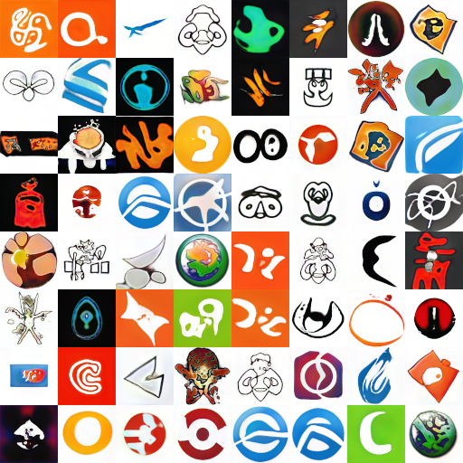

# Conditional-Logo-Generation-with-StyleGAN2

This project is an application of StylGAN2 for logo generation.

The model implementation comes from [here](https://github.com/manicman1999/StyleGAN2-Tensorflow-2.0/) with some changes to support conditional GANs.

Original paper: [Analyzing and Improving the Image Quality of StyleGAN](https://arxiv.org/abs/1912.04958)

## Example of randomly generated logos

## Variation of the same logo by changing condition and style

## Screenshot of GUI

